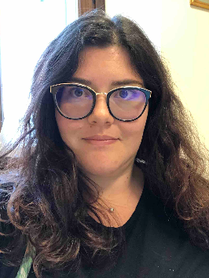

# About me

I am Associate Professor of Statistics at the Departmet of Statistical Sciences at [Università Cattolica del Sacro Cuore](www.unicatt.it) of Milano (faculty of Economics).
I work in the area of functional data analysis. 
My full CV is available at this [link](EuroCV_AlessiaPini_EN.pdf).

## Contacts
- Email: [alessia.pini@unicatt.it](alessia.pini@unicatt.it)
- [Institutional web page](https://docenti.unicatt.it/ppd2/it/docenti/68825/alessia-pini/profilo) at Università Cattolica del Sacro Cuore
- ORCID: [https://orcid.org/0000-0001-9235-3062](https://orcid.org/0000-0001-9235-3062)
- Publires: [https://publires.unicatt.it/en/persons/alessia-pini](https://publires.unicatt.it/en/persons/alessia-pini)

# Research interests

My research is largely focussed on nonparametric inference for functional and complex data, on both a global and a local perspective. 
Specifically, I am interested into testing hypotheses on functional data (global tests), and to selecting the portions of the domain responsible for the rejection of a null hypothesis (local tests). 

I have been working with multiple testing issues, with a focus on the control of family wise error rate, and false discovery rate, and on the extensions of such concepts to the case of functional data, where a continuous infinity of tests are performed.

I am also interested in nonparametric inferential methods for complex data such as functional data defined on manifold domains, density functions, and networks. 
Finally, I am currently working on parametric and nonparametric inferential methods for the correlation structure of functional data along the domain. 

# Recent talks

- International Symposium on Nonparametric Statistics 2024. June 25-29, 2024 - Braga, Portugal [slides](/Talks/Pini_ISNPS2024_new.pdf)

# Teaching 

- Università Cattolica del Sacro Cuore: please visit my [institutional web-page](https://docenti.unicatt.it/ppd2/it/docenti/68825/alessia-pini/profilo) for more information about my teaching activities at Università Cattolica del Sacro Cuore.

- Università degli Studi Milano Bicocca - PhD in Economics, Statistics and Data Science: [Computational Statistics 2 @UniMib](/courses/compstat2/compstat2.md) 

# [Publications](publications.md)
